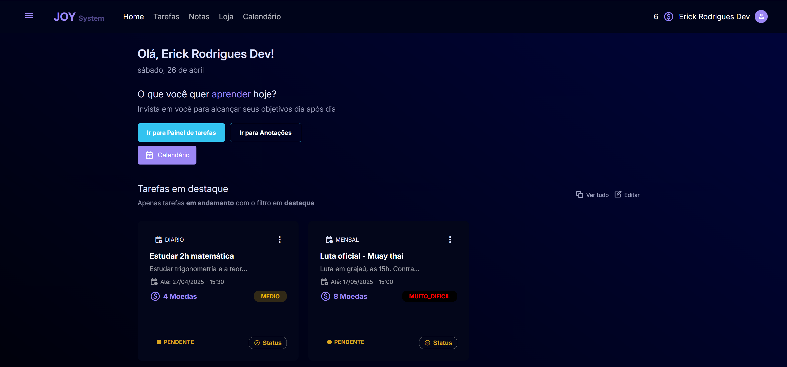
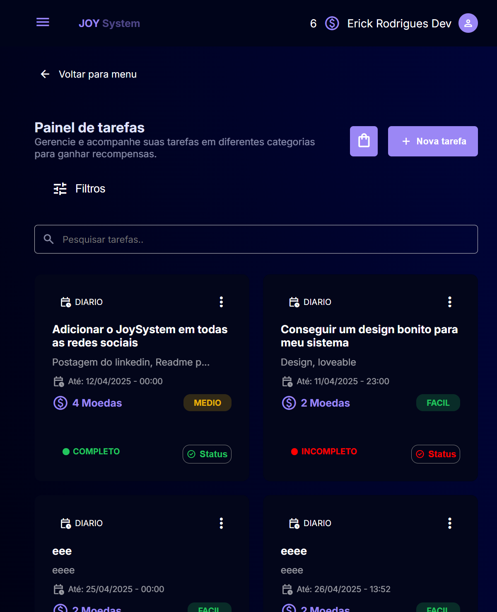
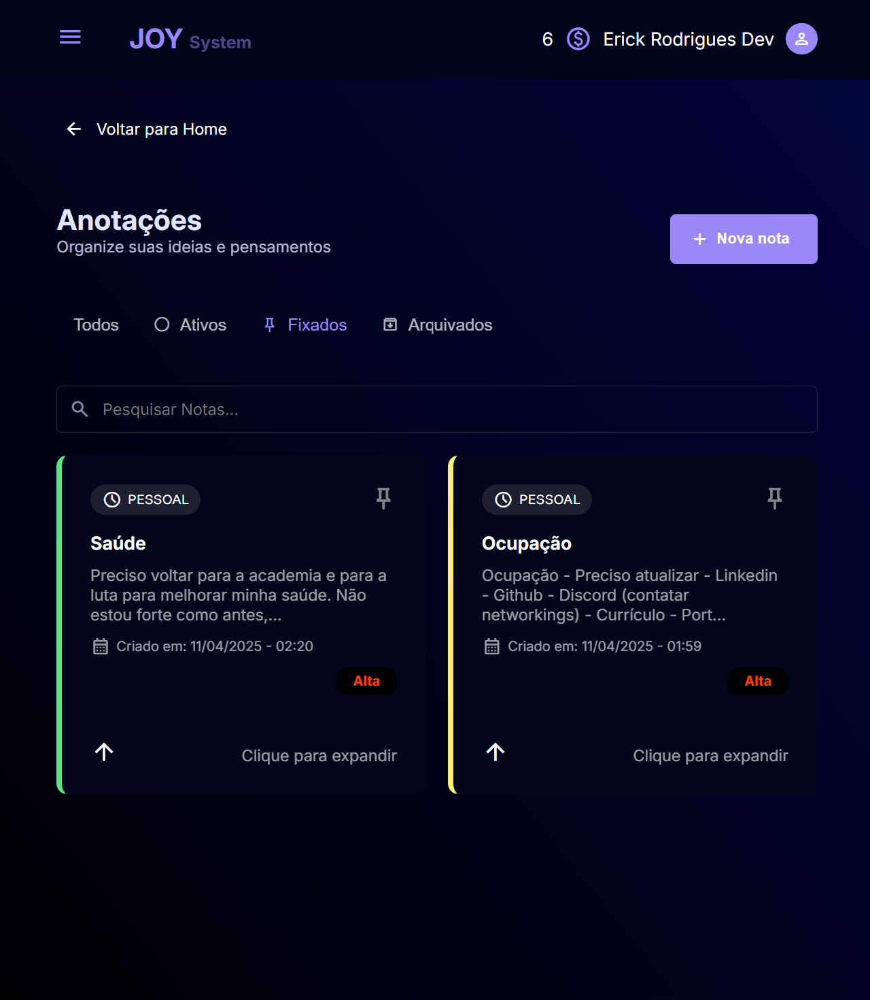
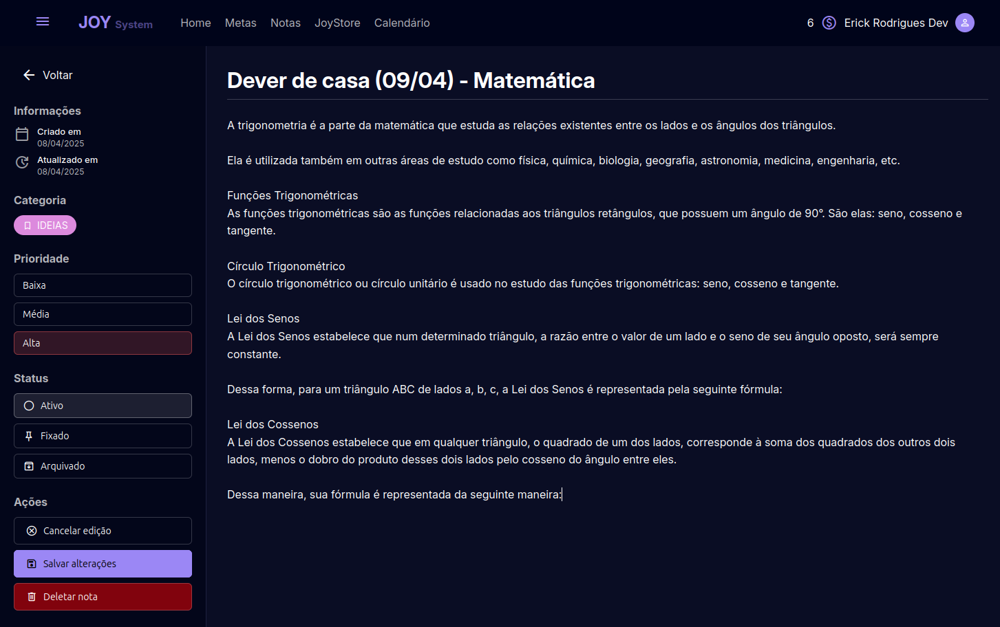
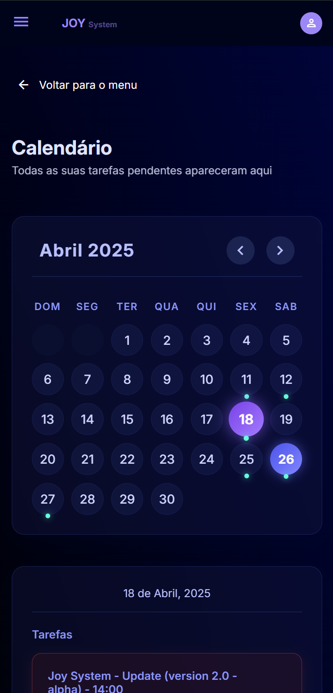

# 🚀 JoySystem - Plataforma de Produtividade

**Transforme seus objetivos em conquistas diárias!**  
O **JoySystem** é uma plataforma gamificada de gestão de tarefas e hábitos, focada em tornar o processo de atingir metas mais divertido, organizado e motivador.

## ✨ Funcionalidades Principais

- **Gestão de Tarefas**: Crie, categorize e acompanhe tarefas personalizadas com níveis de dificuldade e prioridades.
- **Sistema de Moedas**: Ganhe moedas ao completar tarefas e troque por recompensas personalizadas na Loja.
- **Loja Personalizável**: Defina suas próprias recompensas como motivação para continuar progredindo.
- **Sistema de Anotações**: Organize suas ideias e mantenha tudo integrado às suas tarefas.
- **Sugestões por IA** *(em breve)*: Receba ideias personalizadas de tarefas para acelerar seus objetivos.
- **Calendário Integrado**: Visualize, planeje e organize suas tarefas mensalmente.

## 🛠️ Tecnologias Utilizadas

**Frontend:**
- ReactJs
- TypeScript
- Styled Components
- React Hook Form
- Zod

**Backend:**
- NodeJs
- ExpressJs
- TypeScript
- PostgreSQL (Prisma ORM)
- Autenticação JWT + Bcrypt

**Outras ferramentas (deploy):**
- Docker (imagens e containers)
- Railway
- Vercel

## 📈 Como Funciona

1. **Crie suas tarefas** personalizadas, defina prazos, dificuldade e recompensas.
2. **Complete tarefas** para ganhar moedas internas.
3. **Troque moedas** por prêmios que você mesmo definiu na Loja.
4. **Use o calendário** para organizar seu mês e manter o foco.
5. **Receba sugestões da IA** *(em breve)* para nunca ficar sem motivação!

## 📷 Imagens do Projeto

> **Home**

> **Tarefas**

> **Anotações**

> **Anotação detalhada**

> **Calendário**

---

## 🚀 Deploy

- **Frontend**: hospedado na Vercel
- **Backend**: hospedado via Railway + github
- **Banco de dados**: PostgreSQL via Railway

Acesse: [joy-system.vercel.app](https://joy-system.vercel.app)  

## 🤝 Contribuindo

O projeto é pessoal, mas feedbacks e sugestões são sempre bem-vindos!  
Estou no [LinkedIn](https://linkedin.com/in/erickrodrigues-dev).

---

## 📜 Licença

Distribuído sob a Licença MIT.  
Veja `LICENSE` para mais informações.

---

**JoySystem - Transforme suas metas em aventuras diárias!**
